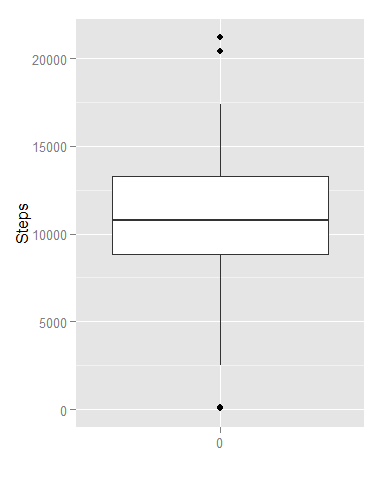
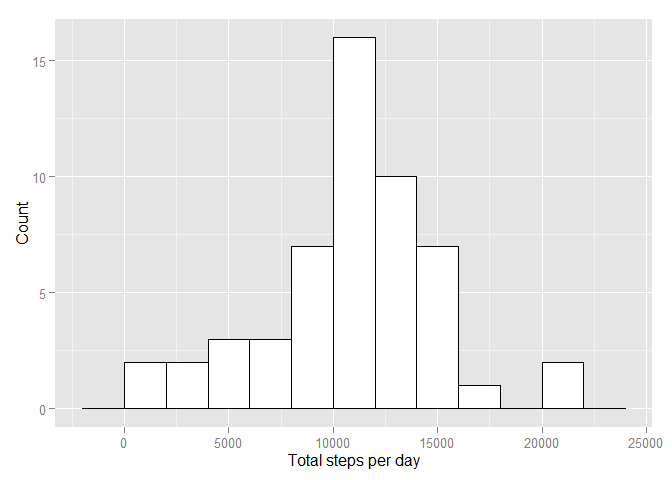
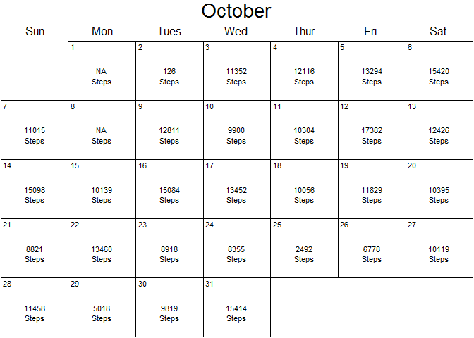
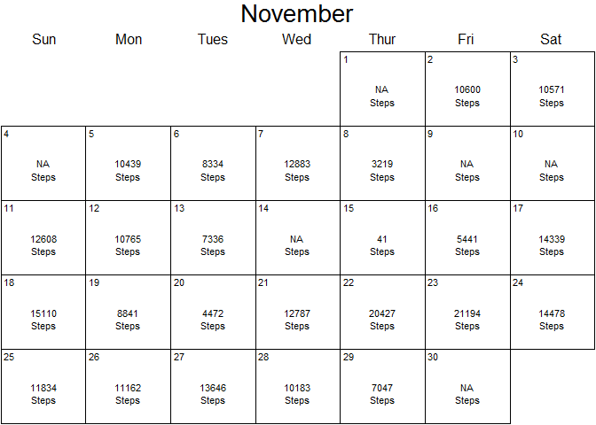
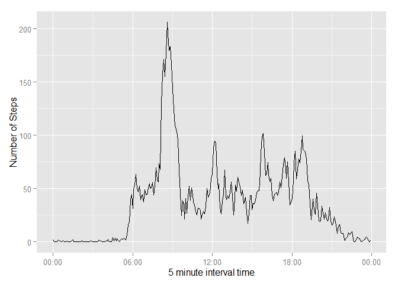
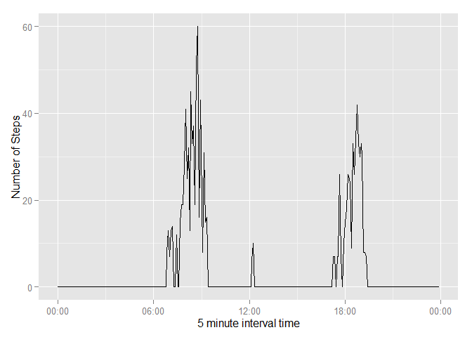
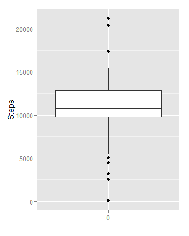
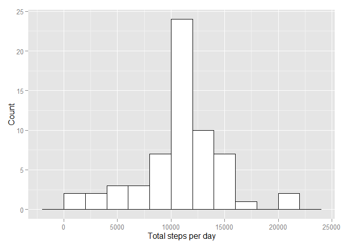
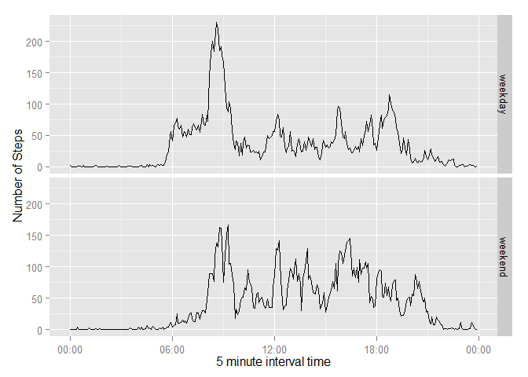

# Reproducible Data Project
John Cartmill  
Sunday, January 18, 2015  


```r
#Load Libraries

library(xtable)
library(TeachingDemos)
library(ggplot2)
library(lubridate)
library(scales)

#Loading and preprocessing the data
#Load the data using read.table 
#Used separotor "," with header set to TRUE
activity<-read.table("C:/Users/John/Documents/R/repdata-data-activity/activity.csv",sep=",",header=TRUE)

#set day of the week and number of the day
activity$day<-weekdays(as.POSIXlt(activity$date))
activity$dayNum<-as.numeric(format(as.POSIXlt(activity$date),"%w"))
#set if it is a weekday or weekend day
activity$dayType<-as.factor(ifelse ((activity$dayNum %% 6) ==0, "weekend", "weekday"))
# This changes interval format from 855 to 08:55 
activity$time<- format(parse_date_time(sprintf("%04d",activity$interval),"HM"),"%H:%M")
#Get a set with no NA values
allSteps<-activity[complete.cases(activity), ]
stepsNa<-activity[!complete.cases(activity), ]
#Alternative method
# allSteps<-activity[!is.na(activity$steps), ]

# get a set with no zero values as well
someSteps<-allSteps[ allSteps$steps > 0, ]
```


```r
#Calculate total number of steps taken per day
totalSteps <- aggregate(allSteps$steps,by=list(allSteps$date),FUN=sum)
colnames(totalSteps)<-c("date","steps")
```
#### Daily Step Statistics
<table border=1>
<tr><td width="33%">
  The mean is 10766.2 .
  <br> With standard deviation 4269.18<br>
  The median is 10765.


```r
ggplot(totalSteps, aes(x=factor(0),y=steps)) + geom_boxplot() +xlab("") +ylab("Steps")
```

 
</td>
<td>

```r
#Make a histogram of the total number of steps taken each day
ggplot(totalSteps, aes(x=steps)) + geom_histogram(binwidth=2000,colour="black", fill="white") + xlab("Total steps per day") + ylab("Count")
```

 
</td>
</tr>
</table>


```r
totalStepsNA <- aggregate(activity$steps,by=list(activity$date),FUN=sum)
colnames(totalStepsNA)<-c("date","steps")
setday<-cal(10,2012)
for (i in 1:31){
setday(i)
if(is.na(totalStepsNA$steps[i])) 
        text(0.5,0.5, "NA")
else
text(0.5,0.5, as.character(totalStepsNA$steps[i]))
text(0.5,0.3, "Steps")
}
setday<-cal(11,2012)
```

 

```r
for (i in 1:30){
setday(i)
if(is.na(totalStepsNA$steps[31+i])) 
        text(0.5,0.5, "NA")
else
text(0.5,0.5, as.character(totalStepsNA$steps[31+i]))
text(0.5,0.3, "Steps")
}
```

 


### Daily Activity Pattern


```r
#Make a time series plot of the 5-minute interval (x-axis) and the average number of steps taken, averaged across all days (y-axis)
meanIntSteps <- aggregate(allSteps$steps,by=list(allSteps$interval,allSteps$time),FUN=mean)
medianIntSteps <- aggregate(allSteps$steps,by=list(allSteps$interval,allSteps$time),FUN=median)
colnames(meanIntSteps)<-c("interval","time","steps")
colnames(medianIntSteps)<-c("interval","time","steps")
maxVal = meanIntSteps[which(meanIntSteps$steps == max(meanIntSteps$steps)),]$interval
```

```r
meanIntSteps$dt<-as.POSIXct(strptime(meanIntSteps$time,format("%H:%M")))
medianIntSteps$dt<-as.POSIXct(strptime(medianIntSteps$time,format("%H:%M")))
ggplot (meanIntSteps,aes(x=dt,y=steps)) + geom_line()+ xlab("5 minute interval time") + ylab("Number of Steps") + scale_x_datetime(labels = date_format("%H:%M"))
```

 

```r
ggplot (medianIntSteps,aes(x=dt,y=steps)) + geom_line()+ xlab("5 minute interval time") + ylab("Number of Steps") + scale_x_datetime(labels = date_format("%H:%M"))
```

 

##### The interval, on average across all the days in the dataset, that contains the maximum number of steps is at 08:35  with a value of 206.1698 steps.

### Imputing Missing Values

The total number of rows with missing values is:
2304

 These occurred on the   
8 
 days listed here:

```r
qd<-unique(stepsNa$date)

for(i in 1:length(qd)){
   if(i == 1){
        countNA<-nrow(stepsNa[stepsNa$date==qd[i],])
    } else {        
       countNA <-c(countNA,nrow(stepsNa[stepsNa$date==qd[i],])) 
        }
}
tableNA<-data.frame(qd,countNA)
colnames(tableNA)<-c("Date","# of NA intervals")
xt<-xtable(tableNA)
print(xt,type="html")
```

<!-- html table generated in R 3.1.0 by xtable 1.7-4 package -->
<!-- Sun Jan 18 19:15:33 2015 -->
<table border=1>
<tr> <th>  </th> <th> Date </th> <th> # of NA intervals </th>  </tr>
  <tr> <td align="right"> 1 </td> <td> 2012-10-01 </td> <td align="right"> 288 </td> </tr>
  <tr> <td align="right"> 2 </td> <td> 2012-10-08 </td> <td align="right"> 288 </td> </tr>
  <tr> <td align="right"> 3 </td> <td> 2012-11-01 </td> <td align="right"> 288 </td> </tr>
  <tr> <td align="right"> 4 </td> <td> 2012-11-04 </td> <td align="right"> 288 </td> </tr>
  <tr> <td align="right"> 5 </td> <td> 2012-11-09 </td> <td align="right"> 288 </td> </tr>
  <tr> <td align="right"> 6 </td> <td> 2012-11-10 </td> <td align="right"> 288 </td> </tr>
  <tr> <td align="right"> 7 </td> <td> 2012-11-14 </td> <td align="right"> 288 </td> </tr>
  <tr> <td align="right"> 8 </td> <td> 2012-11-30 </td> <td align="right"> 288 </td> </tr>
   </table>
#####The strategy chosen for filling in all of the missing values in the dataset is to use the mean for that 5-minute interval.

```r
#

#Create a new dataset that is equal to the original dataset but with the missing data filled in.
cleanactivity <- activity
for (i in 1:nrow(cleanactivity)){
        if(is.na(cleanactivity$steps[i])){
                cleanactivity$steps[i]<-meanIntSteps$steps[meanIntSteps$interval ==cleanactivity$interval[i]]
        }
        
}
#Make a histogram of the total number of steps taken each day and Calculate and report the mean and median total number of steps taken per day.

totalStepsClean <- aggregate(cleanactivity$steps,by=list(cleanactivity$date),FUN=sum)
colnames(totalStepsClean)<-c("date","steps")
```
#### Daily Step Statistics with Imputed NA Values

<table border=1>
<tr><td width="33%">
  The mean is 10766.2 .
  <br> With standard deviation 3974.39<br>
  The median is 10766.2.  
  Since mean values were chosen to replace NA values mean for the imputed data set is the same as the original data. 
  <br>
  The median is equal to the mean, this occurs because there is a cluster of 8  days near the center of the distribution with values equal to the mean.


```r
ggplot(totalStepsClean, aes(x=factor(0),y=steps)) + geom_boxplot() +xlab("") +ylab("Steps")
```

 
</td>
<td>

```r
#Histogram of the total number of steps taken each day
ggplot(totalStepsClean, aes(x=steps)) + geom_histogram(binwidth=2000,colour="black", fill="white")+ xlab("Total steps per day") + ylab("Count")
```

 
</td>
</tr>
</table>
## Weekends versus weekdays

```r
#Panel plot containing a time series plot  of the 5-minute interval (x-axis) and the average number of steps taken, averaged across all weekday days or weekend days (y-axis). 

cwd <- aggregate(cleanactivity$steps,by=list(cleanactivity$interval,cleanactivity$dayType,cleanactivity$time),FUN=mean)
colnames(cwd)<-c("interval","dayType","time","steps")
cwd$dt<-as.POSIXct(strptime(cwd$time,format("%H:%M")))
ggplot(cwd,aes(x=dt,y=steps)) + geom_line() +facet_grid(dayType ~ .) + xlab("5 minute interval time") + ylab("Number of Steps") + scale_x_datetime(labels = date_format("%H:%M"))
```

 
